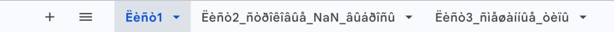
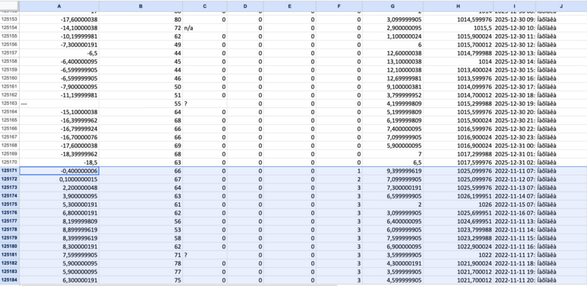

## 1.Раскрываем скрытые данные в первом листе
### Убираем цвет текста с черного на белый

## 2.Раскрываем скрытые листы и удаляем пустые

## 3.Перенос данных
### Во втором листе справа расположена часть данных. Копируем их и переносим в конец под соответствующие столбцы

### Нам не особо важно, что нарушается таймлайн, все равно произведем сортировку данных в последующем

Всю остальная обработка выполняется программно